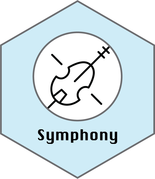

<!-- README.md is generated from README.Rmd. Please edit that file -->

# Symphony 

<!-- badges: start -->
<!-- badges: end -->

Efficient and precise single-cell reference atlas mapping with Symphony

[Preprint on
bioRxiv](https://www.biorxiv.org/content/10.1101/2020.11.18.389189v2)

# Installation

Symphony is available on CRAN:

``` r
install.packages("symphony")
```

Install the development version of Symphony from
[GitHub](https://github.com/) use:

``` r
# install.packages("devtools")
devtools::install_github("immunogenomics/symphony")
```

Install should take &lt;10 mins (pending no major issues). See
installation notes below.

# Usage/Demos

## Tutorials

-   Check out the [quick start (&lt;5 min) PBMCs
    tutorial](https://github.com/immunogenomics/symphony/blob/main/vignettes/pbmcs_tutorial.ipynb/)
    for an example of how to build a custom reference and map to it.

-   Check out the [pre-built references
    tutorial](https://github.com/immunogenomics/symphony/blob/main/vignettes/prebuilt_references_tutorial.ipynb)
    for examples of how to map to provided Symphony references pre-built
    from the datasets featured in the manuscript.

## Downloading pre-built references:

-   You can download pre-built references from
    [Zenodo](https://zenodo.org/record/5090425).

## Reference building

### Option 1: Starting from existing Harmony object

This function compresses an existing Harmony object into a Symphony
reference that enables query mapping. We recommend this option for most
users since it allows your code to be more modular and flexible.

``` r
# Run Harmony to integrate the reference cells
ref_harmObj = harmony::HarmonyMatrix(
        data_mat = t(Z_pca_ref),   # starting embedding (e.g. PCA, CCA) of cells
        meta_data = ref_metadata,  # dataframe with cell metadata
        theta = c(2),              # cluster diversity enforcement
        vars_use = c('donor'),     # variable to integrate out
        nclust = 100,              # number of clusters in Harmony model
        max.iter.harmony = 10,     # max iterations of Harmony
        return_object = TRUE,      # set to TRUE to return the full Harmony object
        do_pca = FALSE             # do not recompute PCs
)

# Build Symphony reference
reference = buildReferenceFromHarmonyObj(
        ref_harmObj,            # output object from HarmonyMatrix()
        ref_metadata,           # dataframe with cell metadata
        vargenes_means_sds,     # gene names, means, and std devs for scaling
        loadings,               # genes x PCs
        verbose = TRUE,         # display output?
        do_umap = TRUE,         # run UMAP and save UMAP model to file?
        save_uwot_path = '/absolute/path/uwot_model_1' # filepath to save UMAP model)
```

Note that `vargenes_means_sds` requires column names
`c('symbol', 'mean', 'stddev')` (see [tutorial
example](https://github.com/immunogenomics/symphony/blob/main/vignettes/pbmcs_tutorial.ipynb/)).

### Option 2: Starting from reference genes by cells matrix

This function performs all steps of the reference building pipeline
including variable gene selection, scaling, PCA, Harmony, and Symphony
compression.

``` r
# Build reference
reference = symphony::buildReference(
    ref_exp,                   # reference expression (genes by cells)
    ref_metadata,              # reference metadata (cells x attributes)
    vars = c('donor'),         # variable(s) to integrate over
    K = 100,                   # number of Harmony soft clusters
    verbose = TRUE,            # display verbose output
    do_umap = TRUE,            # run UMAP and save UMAP model to file
    do_normalize = FALSE,      # perform log(CP10k) normalization on reference expression
    vargenes_method = 'vst',   # variable gene selection method: 'vst' or 'mvp'
    vargenes_groups = 'donor', # metadata column specifying groups for variable gene selection within each group
    topn = 2000,               # number of variable genes (per group)
    theta = 2,                 # Harmony parameter(s) for diversity term
    d = 20,                    # number of dimensions for PCA
    save_uwot_path = 'path/to/uwot_model_1', # file path to save uwot UMAP model
    additional_genes = NULL    # vector of any additional genes to force include
)
```

## Query mapping

Once you have a prebuilt reference (e.g. loaded from a saved .rds R
object), you can directly map cells from a new query dataset onto it
starting from query gene expression.

``` r
# Map query
query = mapQuery(query_exp,             # query gene expression (genes x cells)
                 query_metadata,        # query metadata (cells x attributes)
                 reference,             # Symphony reference object
                 vars = NULL,           # Query batch variables to harmonize over (NULL treats query as one batch)
                 do_normalize = FALSE,  # perform log(CP10k) normalization on query (set to FALSE if already normalized)
                 do_umap = TRUE)        # project query cells into reference UMAP
```

`query$Z` contains the harmonized query feature embedding.

If your query itself has multiple sources of batch variation you would
like to integrate over (e.g. technology, donors, species), you can
specify them in the `vars` parameter:
e.g. `vars = c('donor', 'technology')`

# Installation notes

## System requirements:

Symphony has been successfully installed on Linux and Mac OS X using the
devtools package to install from GitHub.

Dependencies:

-   R&gt;=3.6.x
-   RANN
-   data.table
-   irlba
-   stats
-   tibble
-   utils
-   uwot
-   Matrix
-   Rcpp
-   magrittr
-   methods
-   rlang
-   ggplot2
-   RColorBrewer
-   ggrastr
-   ggrepel

## Troubleshooting:

-   You may need to install the latest version of devtools (because of
    the recent GitHub change from “master” to “main” terminology, which
    can cause `install_github` to fail).
-   You may also need to install the lastest version of Harmony:

``` r
devtools::install_github("immunogenomics/harmony")
```

We have been notified of the following installation errors regarding
`systemfonts`, `textshaping`, and `ragg` (which are all required by
`ggrastr`):

    # error when installing systemfonts
    ft_cache.h:9:10: fatal error: ft2build.h: No such file or directory

    # error when installing textshaping
    Configuration failed to find the harfbuzz freetype2 fribidi library

    # error when installing ragg
    <stdin>:1:10: fatal error: ft2build.h: No such file or directory

These errors are not inherent to the Symphony package and we cannot fix
them directly. However, as a workaround, you can install `systemfonts`,
`textshaping`, and `ragg` separately using `install.packages()` and
specify the path to the required files (replacing `/path/to` below with
the path to the appropriate `include` directory containing the files).

    # fix to install systemfonts
    withr::with_makevars(c(CPPFLAGS="-I/path/to/include/freetype2/"), install.packages("systemfonts"))

    # fix to install textshaping
    withr::with_makevars(c(CPPFLAGS="-I/path/to/include/harfbuzz/ -I/path/to/include/fribidi/ -I/path/to/include/freetype2/"), install.packages("textshaping"))

    # fix to install ragg
    withr::with_makevars(c(CPPFLAGS="-I/path/to/include/freetype2/"), install.packages("ragg"))

# Reproducing results from manuscript

Code to reproduce Symphony results from the Kang et al. manuscript is
available on
[github.com/immunogenomics/symphony\_reproducibility](https://github.com/immunogenomics/symphony_reproducibility).
